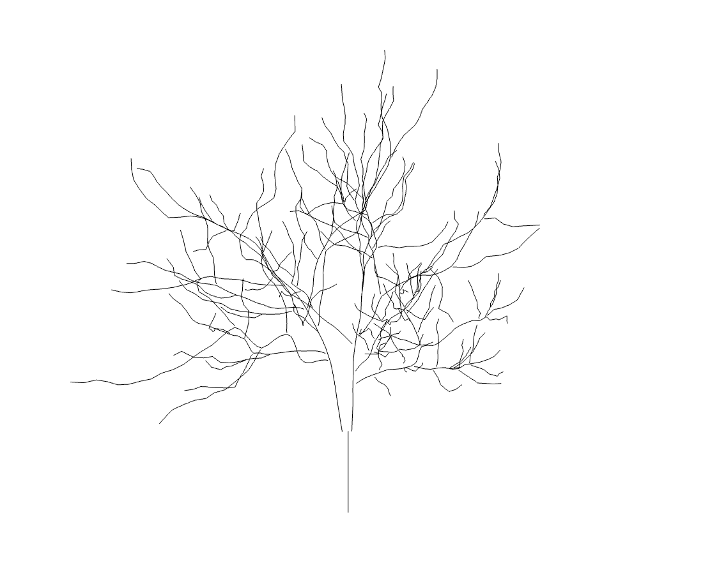
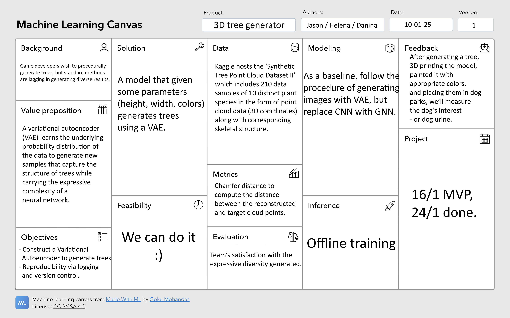

# tree

## Project description

Modelling objects is a tedious, yet essential, process. An example of its prevalence is in 3D video game background modeling which requires vast knowledge of object anatomy and variation across species. There is therefore an incentive to leverage this process; especially for ubiquitous objects such as different types of trees. This project therefore aims at generating point clouds representing trees.

[The synthetic tree point cloud dataset](https://www.kaggle.com/datasets/harrydobbs/synthetic-trees-ii) provides 210 data samples of in total 10 distinct plant species. The data itself consists of the point cloud data (3D coordinates) along with the corresponding skeletal structure, see figure below. 




*Image description: A data sample from the dataset. It contains the point cloud (left) along with the corresponding skeleton structure; also referred to as branches (right)*

The model chosen to tackle this particular task is a Variational Autoencoder (VAE). By encoding the data to a lower-dimensional latent space, the hope is that the model will learn the underlying probability distribution of the data in order to reconstruct the point cloud and branches. A similar task was undertaken on [Dental Point Clouds](https://arxiv.org/abs/2307.10895) with promosing results. If the VAE proves insufficient, a diffusion model will be tested instead. 
The third-party package ```torch_geometric``` will be used in this project as it provides numerous methods for processing geometric data including point clouds and graphs among tools to create and train graph neural networks. In this project it is used to transform the point clouds into a graph thereby capturing the local geometric structures. 

## Project Canvas




## Project structure

The directory structure of the project looks like this:
```txt
├── .github/                  # Github actions and dependabot
│   ├── dependabot.yaml
│   └── workflows/
│       └── tests.yaml
├── configs/                  # Configuration files
├── data/                     # Data directory
│   ├── processed
│   └── raw
├── dockerfiles/              # Dockerfiles
│   ├── api.Dockerfile
│   └── train.Dockerfile
├── docs/                     # Documentation
│   ├── mkdocs.yml
│   └── source/
│       └── index.md
├── models/                   # Trained models
├── notebooks/                # Jupyter notebooks
├── reports/                  # Reports
│   └── figures/
├── src/                      # Source code
│   ├── project_name/
│   │   ├── __init__.py
│   │   ├── api.py
│   │   ├── data.py
│   │   ├── evaluate.py
│   │   ├── models.py
│   │   ├── train.py
│   │   └── visualize.py
└── tests/                    # Tests
│   ├── __init__.py
│   ├── test_api.py
│   ├── test_data.py
│   └── test_model.py
├── .gitignore
├── .pre-commit-config.yaml
├── LICENSE
├── pyproject.toml            # Python project file
├── README.md                 # Project README
├── requirements.txt          # Project requirements
├── requirements_dev.txt      # Development requirements
└── tasks.py                  # Project tasks
```


Created using [mlops_template](https://github.com/SkafteNicki/mlops_template),
a [cookiecutter template](https://github.com/cookiecutter/cookiecutter) for getting
started with Machine Learning Operations (MLOps).
