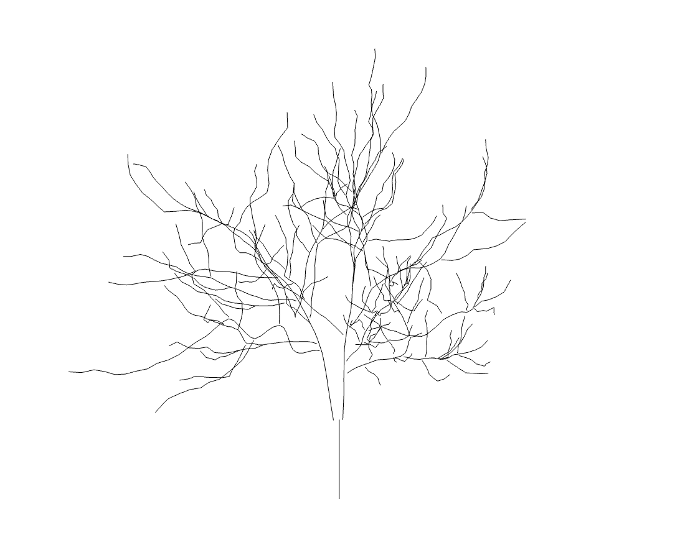

# tree

## Project description

Modelling objects is a tedious, yet essential, process. An example of its prevalence is in 3D video game background modeling which requires vast knowledge of object anatomy and variation across species. There is therefore an incentive to leverage this process; especially for ubiquitous objects such as different types of trees. This project therefore aims at generating point clouds representing trees.

[The synthetic tree point cloud dataset](https://springernature.figshare.com/collections/_/6788358) provides pointclouds from 40 scanning projects on the streets of  Munich. The dataset includes a total of 3755 leaf-off individual point clouds of trees and processed tree quantative models using the algorithm in [TreeQSM](https://github.com/InverseTampere/TreeQSM).

TODO INSERT IMAGES



*Image description: A data sample from the dataset. It contains the point cloud (left) along with the corresponding quantative structure model with the fitted cylinders. (right)*

The model chosen to tackle this particular task is the one presented in [Diffusion Probabilistic Models for 3D Point Cloud Generation](https://arxiv.org/abs/2103.01458) where a PointNet is trained to encode pointclouds into a sort of shape latent space distribution which the diffusion model conditions on and denoises back into a point cloud. When generating new trees, a gaussian N(0,I) would diffused.

Since the tree pointcloud dataset had 100.000s of points, they were downsampled by using the corresponding TreeQSM model, filtering out cylinders with low radius and prioritising branch orders.

## Project Canvas


## Project structure

The directory structure of the project looks like this:
```txt
├── .github/                  # Github actions and dependabot
│   ├── dependabot.yaml
│   └── workflows/
│       └── tests.yaml
├── configs/                  # Configuration files
├── data/                     # Data directory
│   ├── processed
│   └── raw
├── dockerfiles/              # Dockerfiles
│   ├── api.Dockerfile
│   └── train.Dockerfile
├── docs/                     # Documentation
│   ├── mkdocs.yml
│   └── source/
│       └── index.md
├── models/                   # Trained models
├── notebooks/                # Jupyter notebooks
├── reports/                  # Reports
│   └── figures/
├── src/                      # Source code
│   └── project_name/
│       ├── modules/          # Models modules
│       ├── __init__.py
│       ├── app_client.py
│       ├── app.py
│       ├── data.py
│       ├── preprocess.py
│       ├── train.py
│       └── visualize.py
└── tests/                    # Tests
│   ├── __init__.py
│   ├── test_api.py
│   ├── test_data.py
│   └── test_model.py
├── .gitignore
├── .pre-commit-config.yaml
├── LICENSE
├── pyproject.toml            # Python project file
├── README.md                 # Project README
├── requirements.txt          # Project requirements
├── requirements_dev.txt      # Development requirements
└── tasks.py                  # Project tasks
```


Created using [mlops_template](https://github.com/SkafteNicki/mlops_template),
a [cookiecutter template](https://github.com/cookiecutter/cookiecutter) for getting
started with Machine Learning Operations (MLOps).
